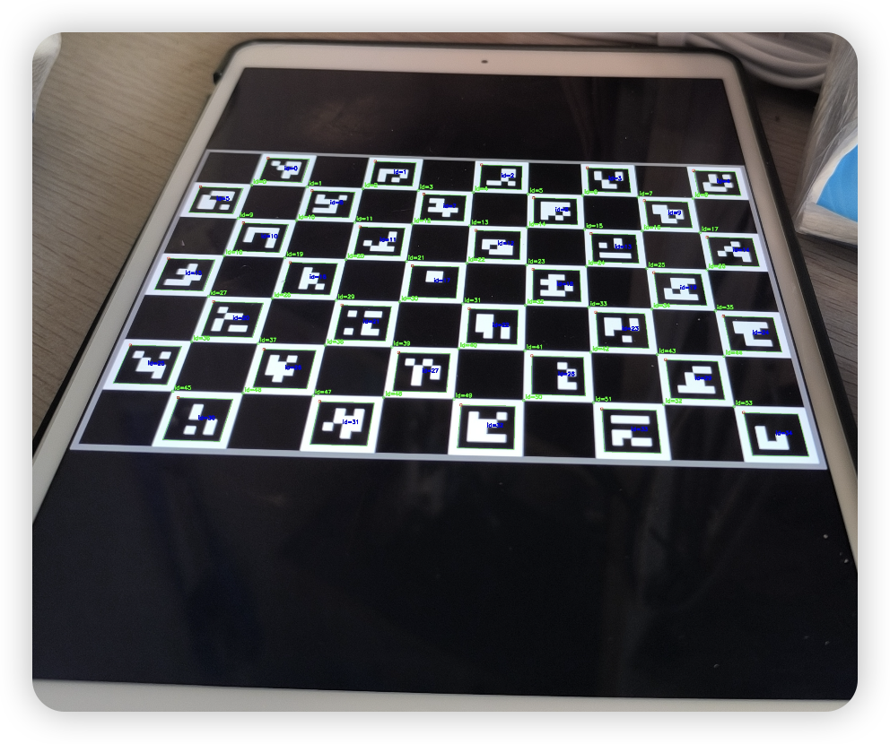

# Camera Alignment System

A camera alignment system based on Flask and OpenCV, designed for real-time camera view alignment with preset masks. It supports ArUco marker detection and camera calibration.

## Process
The core of ArUco marker pose estimation is to transform position information from the camera coordinate system to the marker coordinate system. First, the rotation vector (rvec) is converted to a rotation matrix (R) using the cv2.Rodrigues function, then its transpose (R_inv) is calculated to obtain the rotation transformation matrix from the camera coordinate system to the marker coordinate system. Next, this rotation matrix is multiplied with the translation vector (tvec) and negated to obtain the actual position of the marker in the camera coordinate system (tvec_inv). Based on this position information, we can further calculate the distance (Euclidean distance) and angle (through the arctangent of x and z coordinates) from the marker to the camera, with all distance measurements in meters.

  

 

## Features

### 1. Camera Alignment
- Real-time video stream display
- Multiple camera view support
- Adjustable mask opacity
- Mask toggle control
- Real-time alignment status

### 2. ArUco Marker Detection
- Multiple ArUco dictionary support
- Real-time pose estimation
- Distance and angle calculation
- Coordinate axis visualization

### 3. Camera Calibration
- Charuco board calibration support
- Automatic parameter saving
- Multi-image batch calibration
- YAML format parameter storage

## Tech Stack

- **Backend**:
  - Flask
  - OpenCV (cv2)
  - NumPy
  - Awkward Array
  
- **Frontend**:
  - HTML5
  - CSS3
  - Layui
  - JavaScript

## Image Examples

### ArUco Markers
Located in `assert/images/` directory:

1. **ArUco_full.png**
   
   - Complete ArUco marker board example
   - Used for camera calibration and pose estimation
   - Contains multiple 4x4 ArUco codes

2. **ArUco_single.png**
   
   - Single ArUco marker example
   - Used for basic position detection and tracking
   - Shows standard 4x4 ArUco code format

### Calibration and Detection Results
Located in `output/` directory:

1. **01_output.jpg**
   - Camera calibration process visualization
   - Shows detected Charuco corners
   - Includes overlaid coordinate axes
   - Used to verify calibration and detection accuracy

2. **calibration.yaml**
   - Stores camera calibration parameters
   - Contains camera matrix and distortion coefficients
   - Used for subsequent pose estimation

### Usage Examples

1. **Calibration Process - Getting Camera Intrinsics**
   
   - Green points: Detected Charuco corners
   - Red axis: X-axis
   - Green axis: Y-axis
   - Blue axis: Z-axis

2. **ArUco Marker - Getting Camera Extrinsics**
   
   - Standard 4x4 ArUco code example
   - Used for real-time position tracking

## References

openCV Object Detection Documentation